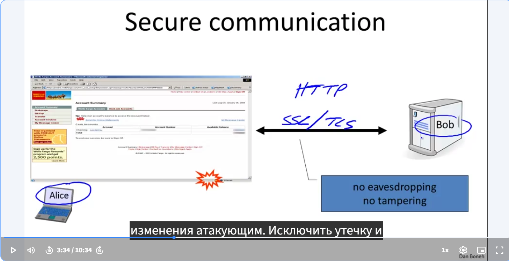
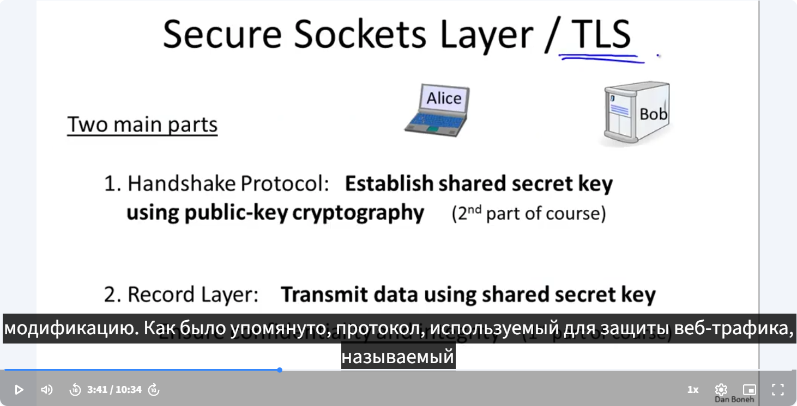
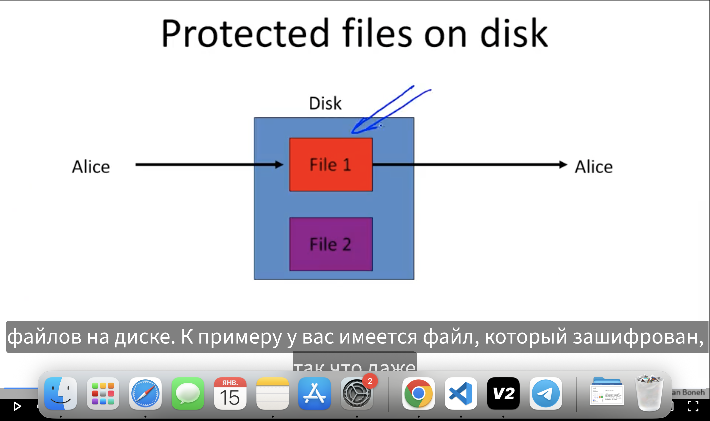
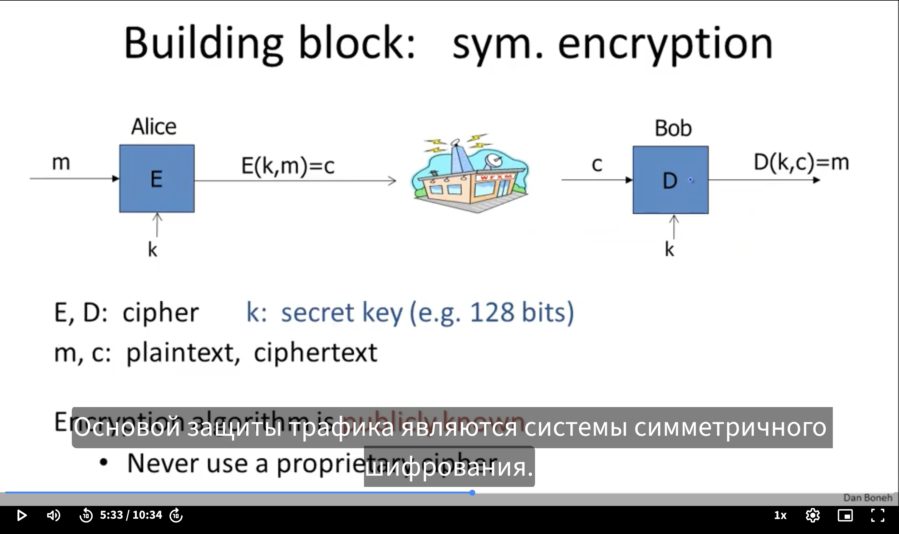
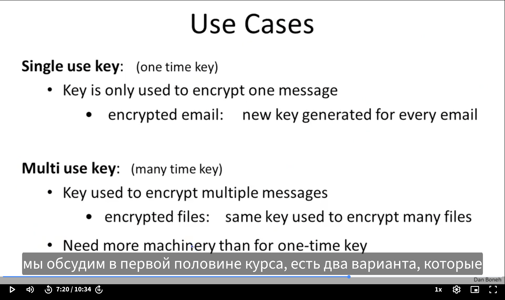
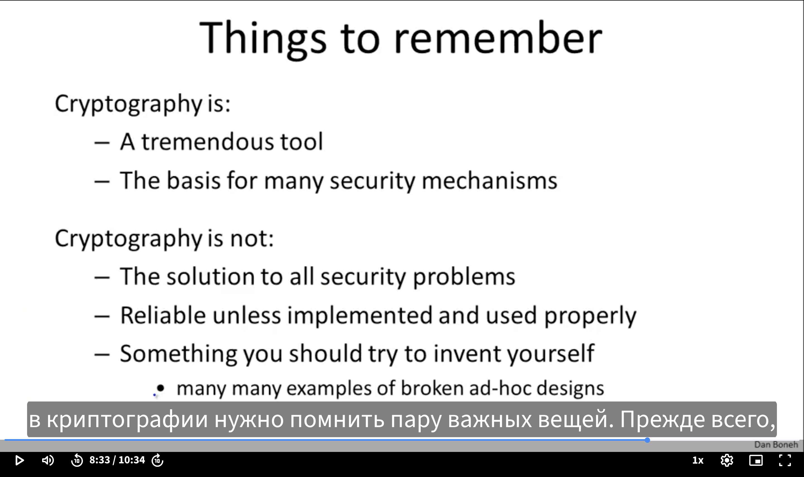

<h1 align="center">Лекция №1</h1>

Алиса - портативный компьютер, Боб - сервер. Для их связи используется протокол HTTPS (НО на деле это SSL, иногда называемый TLS). Используются протоколы для того, чтобы оградить данные, используемые в сети как и от подслушивания, так и от изменения. Также защищают от утечек и модификаций.

Протокол TLS, используемый для защиты трафика, состоит их двух частей: первая - протокол рукопожатия - когда Алиса и Боб разговаривают друг с дургом - в конце хендшейка образуется общий закрытый ключ. При этом ключ знают только Алиса и Боб, а злоумышленник, который захочет подслушать их разговор - понятия не имеет, что это за ключ. Процесс установления секретного ключа и рукопожатия - это криптография публичного ключа, она расматриватется на курсе Cryptogrphy 2.

Криптография - это еще и защита файлов на диске. К примеру у нас есть файл, который зашифрован, и даже если диск будет украден - содержимое файла невозможно будет узнать. И если злоумышленник попытается изменить данные на диске, Алиса, попытавшись расшифровать файл сразу обнаружит это. В целом - есть конфиденциальность и защита файлов на диске.

---
<h2>Философское замечание - хранение зашифрованных файлов на диске - тоже самое, что и защита коммуникации между Бобом и Алисой.</h2>

---

В частности, когда мы храним файлы на дискетах - Алиса записывает файлы для себя же, чтобы использовать их потом. И считай здесь, вместо диалога Алисы с Бобом происходит диалог Алисы с собой завтрашей.

Основой защиты трафика является система симметричного шифрования, в таких системах двое (Алиса и Боб) имеют общий секретный ключ K, который вообще неизвестен злоумышленнику. Алиса и боб используют шифр, который состоит из двух алгоритмов: E и D, где E - алгоритм шифрования, а D - алгоритм дешифрования. Алгоритм шифрования берет текст и ключ как входные данные и делает с ними преобразования - формирует соответствующий зашифрованный текст. 

Алгоритм дешифрования делает обратное: берет зашифрованный текст и ключ как входные данные и также производит с ним преобразования - дает на выходе исходный текст. <strong>ВАЖНО:</strong> алгоритмы шифрования и дешифрования публичные, и даже злоумышленник знает, как они работают. Единственное что держится в секрете - это секретный ключ K. Все остальное - известно всем. Здесь важно понимать, что нужно использовать только известные всем алгоритмы шифрования, поскольку они проверялись годами и сотнями тысяч людей, и их так и не удалось взломать. Если нам предлагают воспользоваться каким-либо проприетарным алгоритмом шифрования - лучше от этого воздержаться и придерживаться стандартам. Поскольку было уже очень много таких проприетарных методов шифрования, которые были взломаны путем обычного анализа. 

Поэтому всегда в методах симметричного шифрования есть два случая:
<ol>
  <li>Когда каждый ключ используется для шифрования отдельного сообщения, так называемое "шифрование одноразовым ключом". Например, когда мы шифруем сообщение по электронной почте, то каждое сообщение шифруется при помощи различных ключей, ключей симметричного шифрования. Так как ключ используется для шифрования одного сообщения - есть простые и эффективные способы шифрования сообщений.</li>
  <li>Бывает, что ключом необходимо зашифровать уже большое количество сообщений. Такие ключи уже называются многоразовыми. Например, когда шифруются файлы в файловой системе - один и тот же ключ используются для шифра всех файлов. Получается, если ключ уже используется многократно - то нам уже нужно будет потрудиться, чтобы убедиться, что система шифрования безопасна.</li>
</ol>

Криптография - идеальный элемент защиты информации информации в компьютерных системах. Но она не решает всех проблем безопасности: если в программе есть баги - то криптография уже не сможет никому помочь. Криптография не спасет от социальной инженерии, когда злоумышленники обманом заставляют причинять вред самим себе. <strong>ВАЖНО:</strong> Криптография бесполезна, если по своей сути она реализована неправильно. Могут быть системы, которые как бы работают правильно, и те же Боб и Алиса мог друг с другом общаться, получать сообщения и расшифровывать их, но поскольку криптография может быть реализована неправильно - все эти сообщения могут быть прочитаны.

